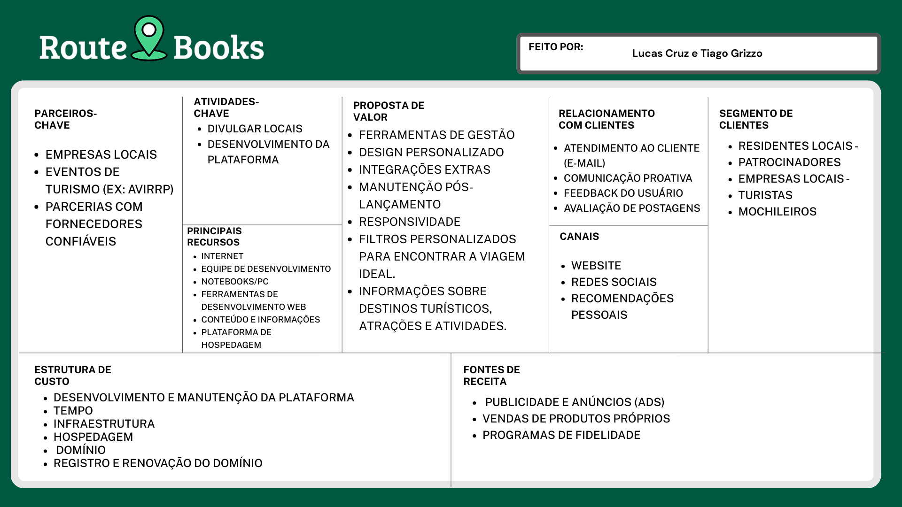
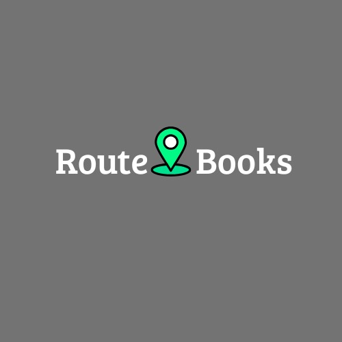
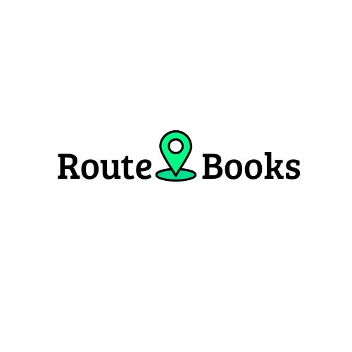
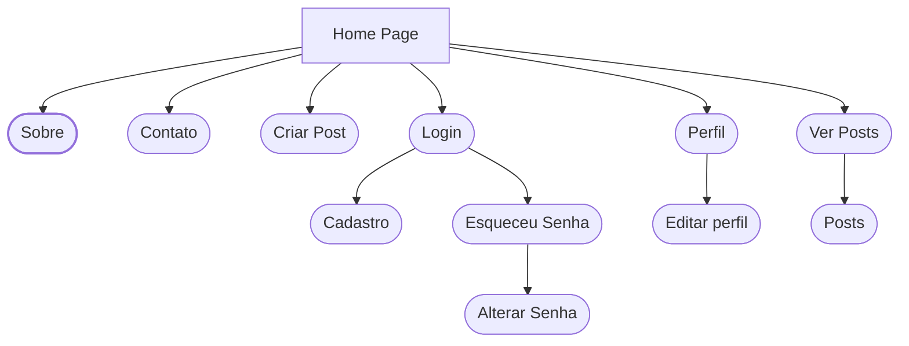
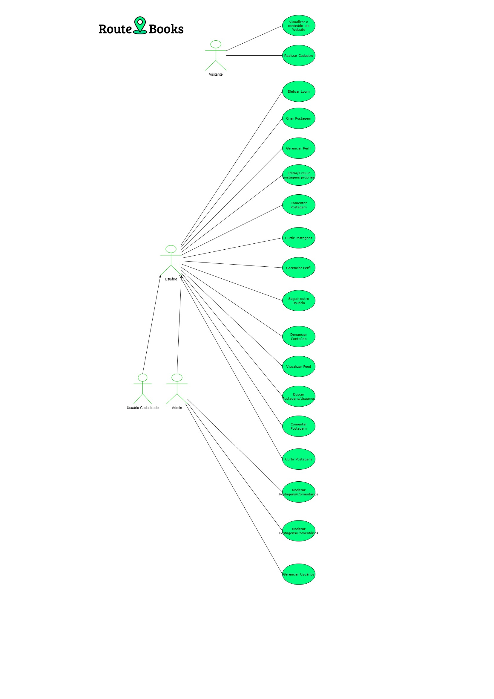
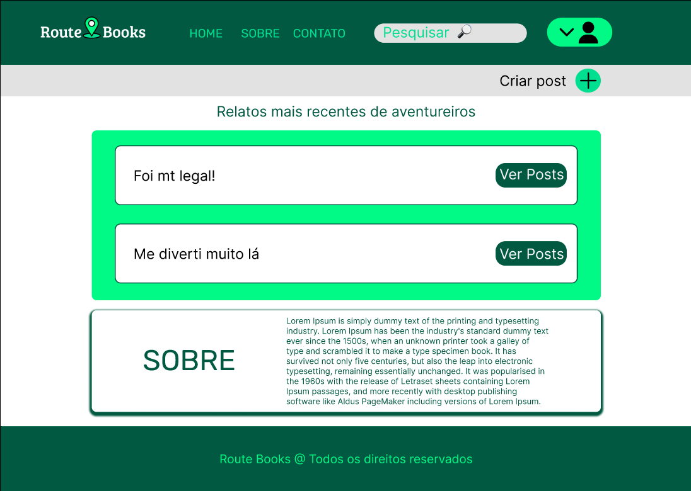

  <picture>
  
  </picture>
  
  #  Dicas para mochileiros e viajantes
  ### Centro Paula Souza
  ### Faculdade de Tecnologia de Jahu - FATEC JAHU 
  ### Curso de Tecnologia em Desenvolvimento de Software Multiplataforma
  ### Feito por Lucas Eduardo e Tiago Augusto 
  ### Jaú-SP, Brasil. 
  ### Início: 1º Semestre / 2025
  # Documento da aplicação web

<h1>Sumário</h1>

  - [1. Resumo da aplicação web](#1-resumo-da-aplicação-web)
    - [1.1. Objetivos](#11-objetivos)
    - [1.2 Métodos da pesquisa](#12-métodos-da-pesquisa)
  - [2. Documento de requisitos](#2-documento-de-requisitos)
    - [2.1. Requisitos funcionais](#21-requisitos-funcionais)
    - [2.2. Requisitos não funcionais](#22-requisitos-não-funcionais)
  - [3. Regras de negócio](#3-modelo-de-negócios)
    - [3.1. O que será elaborado?](#31-o-que-será-elaborado)
    - [3.2. Como será elaborado?](#32-como-será-elaborado)
    - [3.3. Para quem será elaborado?](#33-para-quem-será-elaborado)
    - [3.4. Quanto custará?](#34-quanto-custará)
  - [4. Estudo de viabilidade](#4-estudo-de-viabilidade)
  - [5. Design](#5-design)
  - [6. Protótipo](#6-protótipo)
  - [7. Aplicação](#7-aplicação)
  - [8. Considerações finais](#8-considerações-finais)
  - [Referências bibliográficas](#referências-bibliográficas)

# 1. Resumo da aplicação web
Este projeto tem por objetivo facilitar que pessoas apaixonadas por lugares históricos e bonitos, consigam achar grandes aventuras, com dicas sobre pontos turísticos, restaurantes tradicionais, entre outras variedades. Falaremos sobre pontos REGIONAIS, NACIONAIS E DO MUNDO. A ideia é que a plataforma seja de utilização simples, com informações claras e objetivas, que não deixe os clientes confusos ou perdidos (Pesquisar determinado local e achar ele com agilidade)
Utilizamos alguns sites que existem nesta área e juntamos com nosso interesse por lugares turísticos, que contam sua história e valorizam o que tem.

## 1.1. Objetivos
USUÁRIOS/CLIENTES: 
Facilitar que pessoas apaixonadas por lugares históricos e bonitos com belas histórias, consigam achar grandes aventuras, com dicas sobre pontos turísticos, restaurantes tradicionais, entre outras variedades.

EMPRESA/EQUIPE
Fortalecer a marca, se colocando no mercado.
A nossa felicidade é deixar os nossos clientes satisfeitos e encantados, críticas são bem-vindas para a melhoria da equipe e do nosso Website, para que problemas sejam resolvidos e nossa evolução seja contínua.
 

## 1.2. Métodos da pesquisa
A pesquisa e o desenvolvimento do projeto estão sendo realizados com o apoio da infraestrutura disponibilizada pela Fatec de Jahu. As atividades ocorrem tanto durante as aulas quanto nos períodos livres, utilizando os computadores dos laboratórios da instituição, bem como os computadores pessoais dos integrantes da equipe. 

As tecnologias utilizadas até o momento incluem HTML, CSS, JS, Bootstrap para a construção da interface e estrutura da aplicação. O protótipo visual está sendo desenvolvido por meio da ferramenta Figma, que permite a criação colaborativa de interfaces. Além disso, está sendo utilizada a biblioteca Font Awesome para a inserção de ícones que enriquecem a experiência do usuário. Para o desenvolvimento do back-end, será empregado PHP em conjunto com MySQL e XAMPP. O código é desenvolvido no VS Code e versionado com Git, garantindo organização e controle das alterações.

<h3 align="center">
   &nbsp;&nbsp;
   &nbsp;&nbsp;
   &nbsp;&nbsp;
   &nbsp;&nbsp;
   &nbsp;&nbsp;
   &nbsp;&nbsp;
   &nbsp;&nbsp;
   &nbsp;&nbsp;
  
</h3>

Todo o trabalho está sendo conduzido nas dependências da Fatec de Jahu, local que oferece o suporte necessário para o desenvolvimento do projeto. As atividades estão sendo realizadas durante o primeiro semestre do curso, em alinhamento com os conteúdos estudados nas disciplinas, o que possibilita a aplicação prática dos conhecimentos adquiridos em sala de aula. 

[Voltar para o início](#inicio)

# 2. Documento de requisitos
Um documento de requisitos de sistema é um arquivo que descreve o que o sistema deve fazer e como ele deve funcionar. Ele serve para orientar a equipe de desenvolvimento e garantir que todos entendam as necessidades do projeto. Nele estão incluídas as funções principais do sistema, regras importantes e características como segurança e facilidade de uso.

## 2.1. Requisitos funcionais

<h3>Requisitos que foram implementados</h3>

### RF1 – Exibir informações da equipe: 
O sistema deve exibir importantes informações pessoais e curriculares equipe, como: Nome, e-mail, mini-currículo, github, Linkedin, celular

### RF2 - Exibir feedback, disponibilizar chat. 
O sistema deve permitir que os usuários enviem feedback com atributos: Id_pontoturistico, data_da_visita, Id_usuário, comentário. Tendo também nas postagens likes para melhor visibilidade (Para ajudar os clientes e a empresa à melhorar)

### RF3 - Cadastrar usuário 
O sistema deve permitir o cadastro de usuários com as informações: Id_usuario, Nome, celular, e-mail, senha, cpf.

### RF4 - Realizar Login do usuário
O sistema deve permitir o login do usuário utilizando informações pessoais cadastradas (E-mail/Nome de usuário e senha).

### RF5 – Disponibilizar uma página de contato 
O sistema deve exibir um formulário de contato com: id_usuario, e-mail, data, comentário e observação. (conter uma área dedicada a ajudar os usuários com dúvidas e problemas.)

### RF6 - Logout
O sistema deve permitir que os usuários possam se desconectar da sua conta.

<h3>Requisitos que serão trabalhados</h3>

### RF7 - Exibir dicas de pontos turísticos e atividades. 
Exibir dicas de pontos turísticos cadastrados no site: nome, descrição, localização etc. (Explorar melhor o lugar que pretende visitar)

### RF8 - Disponibilizar sistema de busca 
O sistema deve permitir busca dos pontos turísticos, por meio de: Local, nome (parte do nome), categoria (restaurante, hotel, cidade, ponto turístico etc.) – Mais agilidade para o cliente

### RF9 - Exibir busca mais populares 
O sistema deve exibir as avaliações mais frequentes: id_pontoturistico, data, localização, comentário (conter um campo onde contenha as postagens mais populares)

## 2.2. Requisitos não funcionais

<h3>Clique para exibir</h3>

  
### RNF1- Usabilidade
A interface do usuário deve ser intuitiva e fácil de usar. 

### RNF2 - Manutenibilidade
O código do sistema deve ser bem documentado e fácil de entender. 

### RNF3 - Desempenho
O tempo de resposta para mudanças de telas tem que ser em até 5 segundos

### RNF4 - Segurança/Confiabilidade
O sistema deve proteger os dados dos usuários contra acesso não autorizado. 

### RNF5 - Disponibilidade
O sistema deve estar disponível 24x7x30 (100%) do tempo. 

### RNF6 - Acessibilidade 
O sistema possui um modo escuro para facilitar a visualização da aplicação.

[Voltar para o início](#inicio)

# 3. Modelo de negócios
### Figura 1 - Canvas, modelo de negócios:
Na Figura 1, podemos visualizar o modelo de negócios, utilizado para melhor identificação do que o projeto oferece, como estrutura, canais, parceiros...

    

## 3.1. O que será elaborado?
### Proposta de valor:
  - Ferramentas de gestão
  - Tempo de desenvolvimento
  - Design personalizado
  - Integrações extras
  - Manutenção pós-lançamento
  - Responsividade
  - Filtros personalizados para encontrar a viagem ideal.
  - Informações detalhadas sobre destinos turísticos, atrações e atividades.

## 3.2. Como será elaborado?
### Parcerias principais:
  - Empresas locais
  - Eventos de turismo (ex: AVIRRP) 
  - Parcerias com empresas confiáveis 
### Atividades principais:
  - Dicas para o público
  - Divulgar locais (EX: PONTOS TURÍSTICOS, RESTAURANTES.)
  - Desenvolvimento da plataforma.
### Recursos principais:
  - Internet
  - Equipe de desenvolvimento
  - Notebooks/PC
  - Ferramentas de desenvolvimento web
  - Conteúdo e informações
  - PlaTaforma de hospedagem

## 3.3. Para quem será elaborado?
### Segmento de clientes
  - Residentes locais - Jaú
  - Patrocinadores
  - Empresas locais - Jaú
  - Turistas
  - Mochileiros
### Relacionamento com o cliente: 
  - Atendimento ao cliente (E-mail)
  - Comunicação proativa
  - Feedback do usuário
  - Avaliação de postagens.
### Canais: 
  - Website;
  - Redes sociais;
  - Recomendações pessoais;

## 3.4. Quanto custará?
### Estrutura de custos: 
  - Desenvolvimento e manutenção da plataforma 
  - Tempo
  - Infraestrutura
  - Hospedagem  
  - Domínio 
  - Registro e renovação do domínio
### Fontes de renda: 
  - Publicidade e Anúncios (Ads)
  - Programas de afiliados

[Voltar para o início](#inicio)

# 4. Estudo de viabilidade
### Viabilidade técnica: 
Sim, temos os equipamentos necessários fornecidos pela FATEC JAHU, computadores, internet, ferramentas web e um ambiente adequado para a realização do projeto.

### Viabilidade financeira: 
É viável pelo fato que vai ser mão de obra dos integrantes do grupo, não iremos contratar ninguém de fora no momento. Ele irá nos retornar um aprendizado muito grande nessa área e uma bela evolução.

### Viabilidade de mercado: 
Foi feita à análise, no começo erámos uma vitrine para viagens e percebemos que já existiam muitas nesse mesmo estilo, então nos renovamos, pegamos um nicho em específico e hoje somos um tipo de blog/guia turístico para relatos de mochileiros(as), empresas, entre outros, que gostam de viajar e divulgar o seu trabalho e conhecer o que aquele lugar os oferece.

### Viabilidade operacional: 
Até o momento sim, não foram exigidas tantas atividades agora de início, então a organização, suporte e armazenamento está tudo correto.
Agora iremos implementar mais atividades, como Banco de dados ao projeto, JavaScript, PHP e outras tecnologias ao decorrer dos semestres

[Voltar para o início](#inicio)

# 5. Design
### Paleta de cores:

| Nome          | Hexadecimais                      |
|---------------|-----------------------------------|
| TONS DE VERDE | #005940, #00DE90, #00FA85, #04B885 |
| TONS DE AZUL | #00EEFF |
| TONS DE VERMELHO | #FFA6A6 |
| PRETO | #000000 |
| BRANCO | #FFFFFF|

### Tipografia: 

| **Fonte** | **Utilidade** |
|------------|---------------|
| Rubik | Para títulos |
| Nunito | Para páginas envolvendo cadastro, login e esqueci senha |
| Roboto | Para textos gerais da aplicação |

- [Rubik - Google Fonts](https://fonts.google.com/specimen/Rubik)
- [Nunito - Google Fonts](https://fonts.google.com/specimen/Nunito)
- [Roboto - Google Fonts](https://fonts.google.com/specimen/Roboto)

### Logo: 
As figuras apresentadas são as logos do nosso projeto, uma com a escrita em preto e outra com a escrita em branco, pensada para diferentes fundos.

    
    

### Modelo de navegação:
Representação do nosso modelo de navegação, utilizada para observar como o sistema funciona, quais caminhos e processos existem dentro da aplicação.

[Voltar para o início](#inicio)

# 6. Caso de uso 
### Modelo de casos de uso do sistema 
Na imagem abaixo, é visto o modelo de caso de uso da nossa aplicação, que demonstra como será feito todo o processo com um visitante, para que ele vire um usuário e as funçõoes do admin.

  

    
  

[Voltar para o início](#inicio)

# 7. Protótipo
- ### Link dos protótipos com a ferramenta Figma: [Figma - Route Books](https://www.figma.com/design/8UFfrEyZOdytMzzJvd0jSB/Mockup-do-site-PI?node-id=0-1&p=f&t=6UuWB1YErd0NN2MF-0)

### Figura 3 - Protótipo da home
Nesta imagem, é possível visualizar o protótipo da homepage, de como ela seria na aplicação final (Fizemos mais telas, mas coloquei apenas uma para visualização).

  

    
  

# 8. Aplicação
- ### Link para o nosso repositório do GitHub: [Repositório - PI-ROUTE-BOOKS](https://github.com/Guilherme-RR/PI-Route-Books)

A aplicação Route Books, visa facilitar o encontro de pontos turísticos regionais, nacionais e mundiais e atividades atrativas, com as experiências contatadas pelas pessoas que viveram essas aventuras. Assim, tendo uma aplicação mais interativa e com a oportunidade de criar uma boa networking e ser um site informativo para ajudar todos os públicos.  

# 9. Considerações finais
O processo de desenvolvimento foi tudo dentro dos conformes, todos os integrantes foram participativos em diferentes áreas do projeto, protótipos, html, css, documentação, entre outros. No início, tínhamos uma ideia de ser uma vitrine de viagens, com o objetivo de mostrar as agências mais confiáveis para viagens dentro ou fora do Brasil, mas após algumas reuniões decidimos mudar o escopo do nosso projeto, assim se transformando em um guia de viagens, um site para que as pessoas possam dar seus feedbacks e contar suas experiências para os demais, sobre determinados locais e com diferentes culturas, na qual as pessoas podem se interessar e querer viver essa experiência. Ocorreram algumas limitações, principalmente com a internet da instituição, em alguns momentos não conseguíamos progredir ou até concluir certas partes do projeto, as máquinas de alguns laboratórios também eram lentos, então ficava difícil trabalhar, mas conseguimos avançar, pelo fator que fazíamos em casa, isso ajudava. Tivemos algumas dificuldades, algo normal, porque muitos assuntos e tarefas foram novidades para alguns integrantes, fazendo com que ficássemos com um pouco de receio de errar, fazer errado. A aplicação terá um papel importante para o conhecimento de novos costumes, origens, histórias e importância para os integrantes do grupo, fazer um projeto desse envolve muita paciência e dedicação, isso faz com que criemos um certo tipo de maturidade e acostumados com esse tipo de vivência.  

[Voltar para o início](#inicio)

# 10. Referências bibliográficas
ATLASSIAN. Trello. 2025. Disponível em: [https://trello.com/](https://trello.com/)  
FIGMA, Inc. Figma: the collaborative interface design tool. 2025. Disponível em: [https://www.figma.com/](https://www.figma.com/)  
BOOTSTRAP. Disponível em: [https://getbootstrap.com/docs/5.3/getting-started/introduction/  ](https://getbootstrap.com/docs/5.3/getting-started/introduction/  ) 
FONTAWESOME. Disponível em: [https://fontawesome.com/ ](https://fontawesome.com/ ) 
EMOJIPEDIA. Diposnível em: [ https://emojipedia.org/ ]( https://emojipedia.org/ ) 
MAIKON.BIZ. Criador de personas. Disponível em: [Maikon.biz: https://maikon.biz/gerador-de-personas/](https://maikon.biz/gerador-de-personas/)

# Inspirações e referências
MOCHILEIROS. Disponível em: [ https://www.mochileiros.com/    ]( https://www.mochileiros.com/    ) 
TRIPADVISOR. Disponível em: [https://www.tripadvisor.com.br/ ](https://www.tripadvisor.com.br/ ) 
HOME TOUR. Disponível em: [https://hometour.com.br/](https://hometour.com.br/)

[Voltar para o início](#inicio)

## 🌍 Route Books

**Route Books** é um blog colaborativo feito com HTML e CSS, criado para mochileiros e aventureiros que amam explorar o mundo. A plataforma permite que os usuários compartilhem experiências de viagem, ofereçam dicas, tirem dúvidas e montem roteiros personalizados — tudo isso em uma comunidade apaixonada por descobrir novos destinos.

## ✨ Funcionalidades

- 📖 Compartilhamento de relatos de viagem
- 💬 Seção para dicas e perguntas entre mochileiros
- 🗺️ Criação e organização de roteiros personalizados
- 🎒 Interface amigável e responsiva para fácil navegação
- 🧭 Layout pensado para valorizar o espírito aventureiro

## 📸 Imagens do Projeto

**Home Page**

**Tela de Perfil de Usuário**

**Tela de Login**

## 🚀 Como Usar
  
1. Abra seu o Prompt de comando ou o Windows PowerShell.

2. Em um dos programas citados acima, use o comando 'cd ..' até ir para a pasta 'C:', normalmente o comando 'cd ..' precisará ser usado 2 vezes.

3. Estando na pasta 'C:' cole esse comando 'git clone https://github.com/TiagoGrizzo/PI-Route-Books', lembrando que esse comando funcioná somente caso já tenha sido baixado o git no seu computador.

4. Depois de usar o comando citado no passo de cima, entra na pasta do projeto, use o comando 'cd PI-Route-Books'.

5. Agora você pode ir nos arquivos do seu computador usando o explorador de arquivos e por la voce pode até a pasta que você fazendo os passos acima, de dois cliques no arquivo chamado 'index.html' e abra ele com o navegador de sua preferência.

6. Pronto! Agora você pode conferir nosso projeto.
